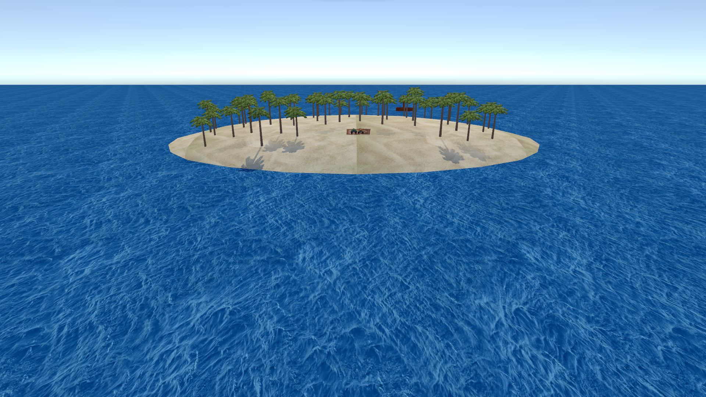
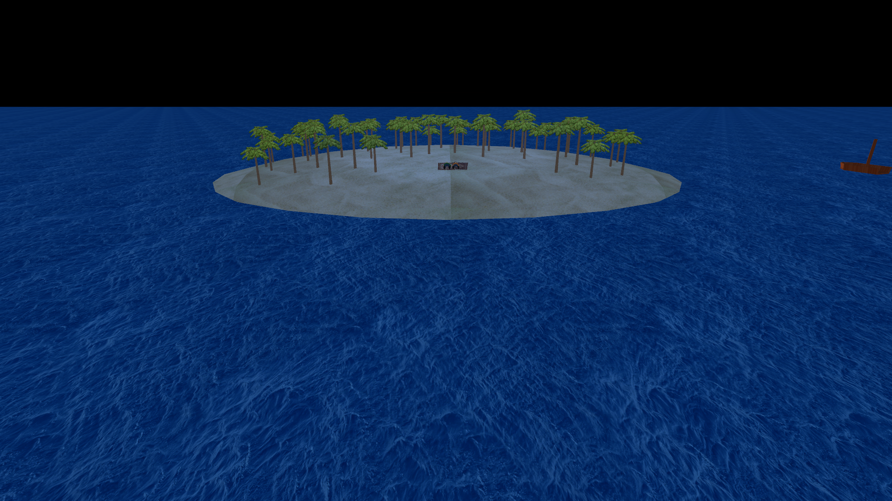
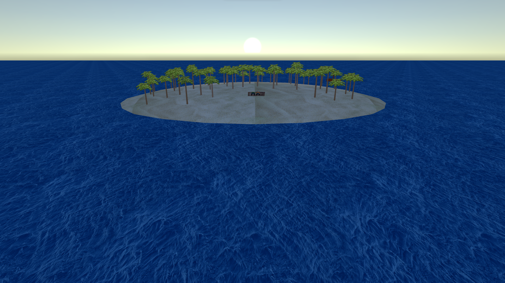
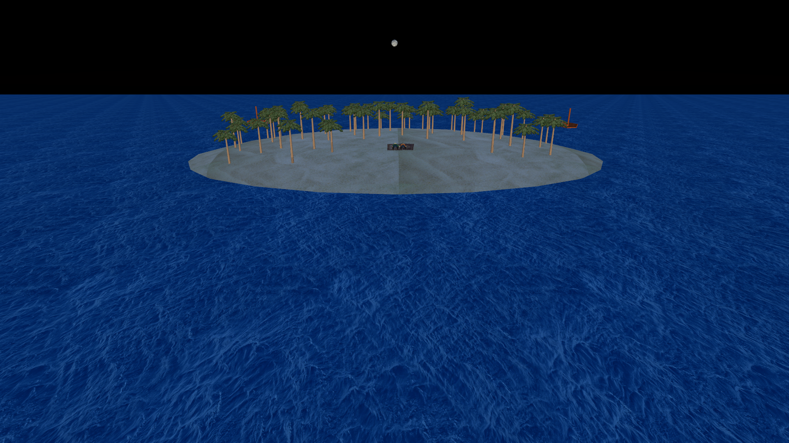
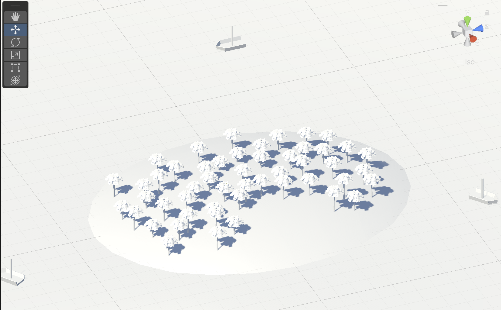
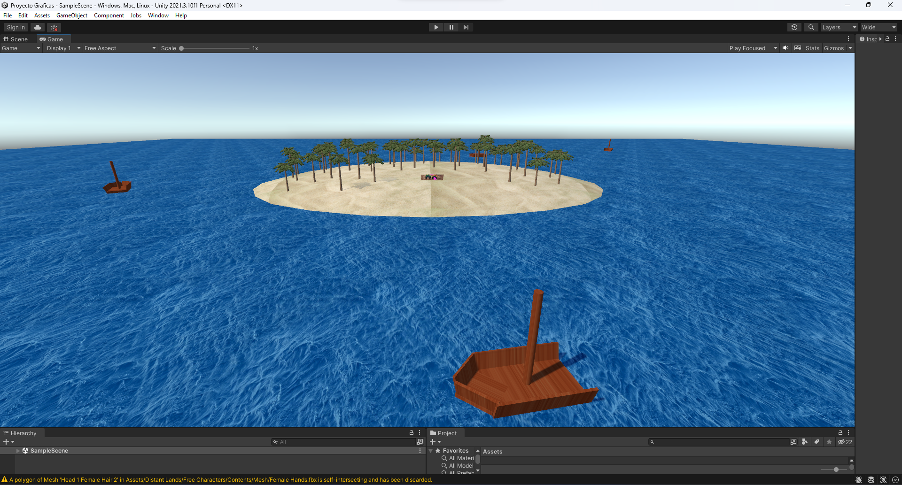

# ProyectoGraficas

## Repositorio

[https://github.com/Mike-Castro/ProyectoGraficas](https://github.com/Mike-Castro/ProyectoGraficas)

## Equipo

A01635930 Mauricio Xavier Garabito Ramirez

A01283439 Miguel Angel Castro Martinez

## Resultado final

[Live Demo usando WebGL!!](https://mike-castro.github.io/ProyectoGraficas/)

[Video del programa corriendo](https://youtu.be/GSE3Qf1aonA)

[Zip con el ejecutable](https://github.com/Mike-Castro/ProyectoGraficas/raw/main/Executables/Beach.zip)

## Avances

### Avance 1: Descripcion

Una isla en el medio del océano, la isla tiene varias palmeras y  hay una pareja acostada en la orilla de la playa. Lanchas y barcos pasan por la isla y se puede ver el sol y la luna moviéndose a través del firmamento. La escena será creada usando Unity.

### Avance 2: Formas en la escena

### Avance 3: Texturas

## Créditos 
Modelos de los personajes: [https://assetstore.unity.com/packages/3d/characters/distant-lands-free-characters-178123#publisher](https://assetstore.unity.com/packages/3d/characters/distant-lands-free-characters-178123#publisher)
